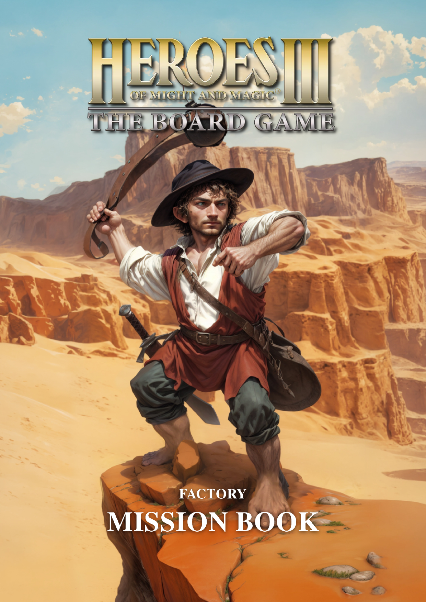

<div align="center">
  <h1>Heroes of Might & Magic III: The Board Game<br>Factory Expansion</h1>

  <p align="center">
    
    <a href="https://discord.gg/nMbawQkj9R"></a>
  </p>
</div>

**Join us [on Discord](https://discord.gg/nMbawQkj9R) to help with development or just to get in touch!**

Download the current PDF:

[](https://raw.githubusercontent.com/qwrtln/Homm3BG-FactoryRulebook-build-artifacts/en/main_en.pdf)

### 💡 What Is This?

This project aims to rewrite the original rule book, in which the amount of vague language was just too vast to ignore.
Its aim is to explain the rules clearly and concisely, and should eventually have an answer for any basic rules query you might have.

### 🤔 Why?

Because why not.

<!-- [//]: # (TODO: add link) -->

### 🛠️ How?

This is a communal effort.
This repository serves both as a means to preserve the work, but also for others to contribute to it as writers, proofreaders, or layout designers.

### 💪 Contributing

You can contribute by opening issues/PRs with suggestions, or joining us [on Discord](https://discord.gg/nMbawQkj9R).

### 🔮 The Future

All new version of the book and their change logs will be published here.

## 💻 Local Development

To work on the document on your machine, you need the following:

- [**MiKTeX**](https://miktex.org/) for Windows, [**MacTeX**](https://www.tug.org/mactex/) for MacOS, [**TeX Live**](https://www.tug.org/texlive/) for Linux (required) to build the PDF file from LaTeX files
- [**Inkscape**](https://inkscape.org/) (required) to render glyphs in the document (while installing on Windows, make sure to tick `Add Inkscape to the System Path` option)
- [**TeXstudio**](https://www.texstudio.org/) (optional) to edit LaTeX files and rebuild the PDF file quickly

<details>
<summary>Click to learn about the technicalities</summary>

To build the document in English, either run this in the command line:

```bash
tools/build.sh
```

or press the `Build & View` ▶️ (F5) button in TeXstudio on the `main_en.tex` file.


### 📸 Screenshots

<details>
<summary>Click to see details</summary>

It is a good practice to share screenshots of your work in pull requests.
You can the script to make PNG images of specified page(s):

```bash
tools/pdf2image.sh <LANGUAGE> <FIRST_PAGE> <LAST_PAGE>
```

Example:

```bash
tools/pdf2image.sh en 5 7
```

To process a single page, use:

```bash
tools/pdf2image.sh en 5
```

Screenshots will appear in ignored `screenshots` direcotry, in the form of `en-05.png`, `en-06.png`, etc.

#### 🎭 Comparing two pages side by side

If you'd like to show a single image of two instances of the same page side-by-side (before|after style), you can use the following script:

```bash
tools/compare_pages.sh -l <language> -r <range> [OPTIONS]
```

The script takes local `main_<language>.pdf` that you built and which contains your changes and compares it with the latest build
of the same language in this repository (e.i. the baseline).

Imagine you want to compare pages 1, then range from 5 to 7, and page 30 in English version. Here's how to use it:

```bash
./tools/compare_pages.sh -l en -r 1,5-7,30
```

It will produce the following files in the `screenshots` directory: `en-01.png`, `en-05.png`, `en-06.png`, `en-07.png` and `en-30.png`.

Open help for more examples and detailed description:

```bash
tools/compare_pages.sh -h
```

**This script requires `pdftoppm` and `imagemagick` utilities.**

</details>

### 🗠 Optimizing PDF files

<details>
<summary>Click to see details</summary>

To reduce output PDF file size significantly, you can use the script utilizing `ghostscript` utility:

```bash
tools/optimize.sh <LANGUAGE>
```

It will output `main_<LANGUAGE>_optimized.pdf` file.

As of writing, for English it produces 24 MB `main_en_optimized.pdf` file without noticeable drop in quality compared to 80 MB `main_en.pdf` built by LaTeX.

</details>

</details>


## Star History

<a href="https://star-history.com/#piotrbruzda/Homm3BG-FactoryRulebook&Date">
  <picture>
    <source media="(prefers-color-scheme: dark)" srcset="https://api.star-history.com/svg?repos=piotrbruzda/Homm3BG-FactoryRulebook&type=Date&theme=dark" />
    <source media="(prefers-color-scheme: light)" srcset="https://api.star-history.com/svg?repos=piotrbruzda/Homm3BG-FactoryRulebook&type=Date" />
    
  </picture>
</a>

## 🛡️ Other Community Projects

- [Rule Book Rewrite Project](https://github.com/Heegu-sama/Homm3BG)
- [Fan-Made Mission Book](https://github.com/qwrtln/Homm3BG-mission-book)
- [Board Game Cards Databse](https://github.com/Mirzipan/Homm3_BG_Database)
